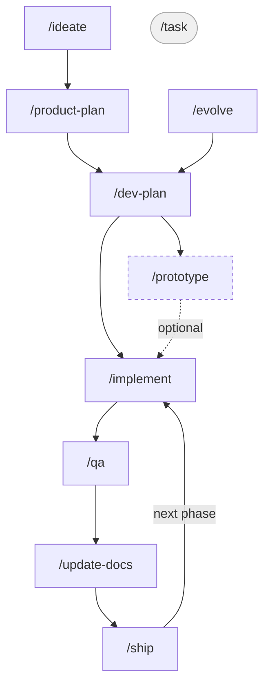

# Harness

A Claude Code and Codex plugin: a complete development workflow in skills, reusable subagents, custom hooks, a next-step recommender skill, and a terminal status line. Clone it once, then keep it in sync from this repository.

## Quick start

1. Clone the repo to a local workspace.
2. Run `bash setup.sh` for the interactive wizard, or `bash setup.sh --full` to install everything without prompts.
3. Restart Claude Code and Codex CLI.

What the script does:
- installs the plugin in Claude Code
- links the skills into Codex CLI
- writes the Codex hook config
- configures the status line in Claude Code

## Prerequisites

- `git`
- Claude Code CLI (`claude`)
- Codex CLI
- `bash`, `jq`, `python3`, `node`, and `npm`

## What's included

| Component | File | Purpose |
|-----------|------|---------|
| Skills | `skills/` | Registered through the plugin and symlinked into Codex |
| Subagents | `agents/` | Reusable specialists packaged with the plugin |
| Hooks | `hooks/codex-hooks.json` | Codex hook source of truth; Claude hooks live in the plugin manifest |
| Rules | `rules/rules.md` | Injected into `~/.claude/CLAUDE.md` and `~/.agents/AGENTS.md` |
| Status line | `scripts/statusline.sh` | Shows git branch, model, context %, and rate limits |

## Skills

There are three entry points depending on where you are:



- **New product** — start with `/ideate`, then follow the chain down to `/ship`.
- **Feature or change on an existing product** — start with `/evolve`, pick up at `/dev-plan`, then continue the same chain.
- **Small fix or tweak** — run `/task` directly; it's a one-shot skill with no planning phase.

### New product workflow

Run these skills in order, from raw idea to shipped product. Each skill reads the documents the previous one wrote, so the chain is self-contained.

| Step | Skill | What it does | Documents |
|------|-------|--------------|-----------|
| 1 | `/ideate` | Research competitors and market viability on the web; decide whether to pursue the idea | Reads the user idea and web sources; writes `.harness/product/idea.md` |
| 2 | `/product-plan` | Define audience, positioning, features, roadmap, and UX through a structured interview | Reads `idea.md`, existing product docs, and the codebase; writes `.harness/product/product.md`, `roadmap.md`, `competitors.md`, `ux.md`, and `CONTEXT.md` |
| 3 | `/dev-plan` | Decide architecture, stack, and generate a technical spec for every must-have feature | Reads `.harness/product/*`, the codebase, and existing engineering docs; writes `.harness/engineering/architecture.md`, `implementation-plan.md`, `features/*.md`, and optional ADRs |
| 4 | `/prototype` | Build throwaway code to answer a specific design question before committing to an approach | Reads the relevant `features/*.md`; writes prototype findings back to the feature spec and optional ADRs |
| 5 | `/implement` | Classify features as HITL/AFK, then implement the current phase as parallel vertical slices | Reads architecture, implementation plan, feature specs, ADRs, and `CONTEXT.md`; writes code changes |
| 6 | `/qa` | Build a feedback loop, test all acceptance criteria, fix simple failures, flag architectural gaps | Reads feature specs, UX docs, README, and test/run config; writes `.harness/qa/report.md` |
| 7 | `/update-docs` | Sync all documentation — internal and public — with the current state of the project | Reads git history, `.harness/*`, public docs, and the codebase; updates stale internal and public docs |
| 8 | `/ship` | Pre-flight checks, version bump and tag, changelog, deploy, and verify the release live | Reads the QA report, release config, and git history; writes the version bump, changelog or tag notes, and roadmap updates |

Step 4 (`/prototype`) is optional — use it when a feature carries high technical uncertainty.
Steps 5–7 repeat for each phase of the roadmap; `/ship` closes out a phase when it's ready for users.

### Evolving an existing product

When the product is already shipped and you want to add a feature, change behavior, or introduce a new nuance, run `/evolve` first. It reads the existing product context, interviews you on the change from a product perspective (audience fit, scope, competitive angle, roadmap priority), updates the relevant harness docs, and hands off to `/dev-plan` for the engineering conversation.

The flow from there is the same as the new product chain: `/dev-plan → /implement → /qa → /update-docs → /ship`.

Use `/task` instead when the change is small enough that no product conversation is needed — a bug fix, a behavior tweak, or a micro-feature.

### Starting mid-flow

If you have an existing project with scattered docs — a `docs/` folder, a `SPEC.md`, an `ARCHITECTURE.md`, notes spread across the repo — run `/migrate-docs` first. It finds everything, classifies it, and migrates it into the harness workflow in one pass.

If the project has code but no docs at all, skip `/ideate` and start with `/product-plan` — it reads the codebase first and reconstructs context from what's already built.

If you are unsure which skill comes next, run `/next-step` first. It inspects the repo and current docs, then recommends the next harness skill.

### Day-to-day changes

Once a product is shipped, most work is small: a bug report, a tweak, a customer request. Run `/task` for these — it makes the change as one verified slice and syncs the affected feature spec on the way out, so `.harness/` docs stay accurate between phases without re-running the planning skills. If the request turns out to be bigger than it looked, `/task` escalates to `/evolve` instead of proceeding.

### Utilities

These can be used at any point in the workflow.

| Skill | What it does |
|-------|--------------|
| `/evolve` | Product interview for a feature addition or change on an existing product; updates docs and hands off to `/dev-plan` |
| `/task` | Small change on a shipped product: classify, fix, verify, sync the feature spec |
| `/next-step` | Inspect the repo and docs to recommend the next harness skill |
| `/migrate-docs` | Discover all existing docs in the repo and migrate them to the harness structure |
| `/handoff` | Compact the current session state into a temp-file for the next agent or session |
| `/zoom-out` | Map all relevant modules and their callers in an unfamiliar area of code |
| `/improve-codebase-architecture` | Find deepening opportunities: refactors that turn shallow modules into deep ones, improving testability and AI-navigability |
| `/write-a-skill` | Create a new harness skill with proper structure, progressive disclosure, and bundled resources |

## Install

```bash
git clone git@github.com:RubenGlez/harness.git ~/workspace/harness
cd ~/workspace/harness
bash setup.sh           # interactive wizard (recommended)
bash setup.sh --full    # install everything without prompts
```

`setup.sh` handles everything without opening Claude Code or Codex:

- Symlinks the repo into `~/.claude/plugins/cache/` and registers it in `installed_plugins.json`
- Writes Codex hooks from `hooks/codex-hooks.json` to `~/.codex/config.toml`
- Ships reusable subagents from `agents/` with the plugin
- Makes skills available in Claude through the plugin and symlinks them into `~/.codex/skills/`
- Configures the status line in `~/.claude/settings.json`

Safe to re-run; every step is idempotent.

## Update

```bash
bash update.sh
```

Pulls the latest changes and re-syncs all installed components (npm deps, Codex config, skill symlinks, global rules). The Claude plugin reloads automatically on the next session via git SHA detection.

## Uninstall

```bash
bash uninstall.sh
```

Reverses everything `setup.sh` did: removes the plugin, skill symlinks, Codex config, rules, and status line config. Other plugins, skills, and config are never touched.

## Third-party tools

These are optional tools that work well alongside the plugin. They are not part of the plugin itself and must be installed separately.

### Skills

**Matt Pocock's skills** (`grill-me`)
```bash
npx skills@latest add mattpocock/skills
```

**Playwright**, browser automation and UI testing

```
/plugin marketplace add claude-plugins-official
/plugin install playwright@claude-plugins-official
```

**Argent**, iOS simulator and Android emulator control

Follow the install guide at [argent.tools](https://argent.tools), then run `argent init` to wire up the MCP in both Claude and Codex.

### Tools

**RTK**, token-saving proxy for Bash commands (60–90% reduction on shell ops)
```bash
brew install rtk
```

Then add the hook to `hooks/codex-hooks.json` and run `bash setup.sh`.

---

## Acknowledgements

- **[Matt Pocock's skills](https://github.com/mattpocock/skills)**: several patterns in this repo are directly inspired by his work — the HITL/AFK classification and vertical slice model (`/implement`) come from `to-issues`; the feedback-loop-first approach and post-mortem (`/qa`) come from `diagnose`; the behavioral testing principle comes from `tdd`; the domain glossary pattern (`CONTEXT.md`) and ADR creation rules come from `grill-with-docs`; and the `/prototype`, `/handoff`, and `/zoom-out` skills are adapted from his originals.
- **[Andrej Karpathy's CLAUDE.md](https://github.com/multica-ai/andrej-karpathy-skills/blob/main/CLAUDE.md)**: the behavioral guidelines in `rules/rules.md` (Think Before Coding, Simplicity First, Surgical Changes, Goal-Driven Execution) are adapted from his work.
